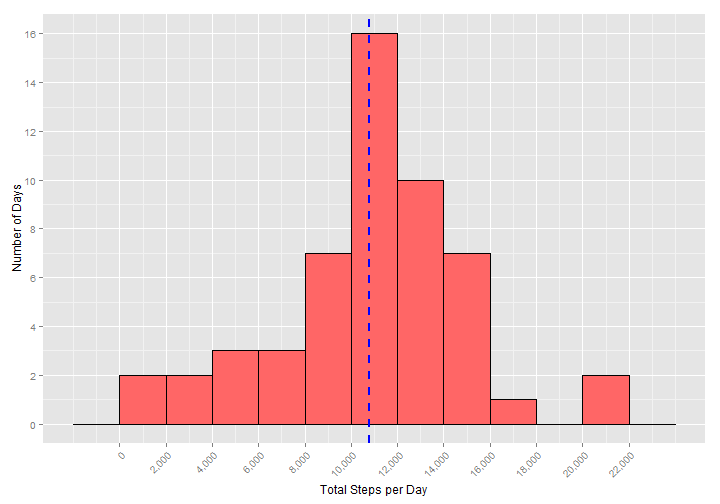
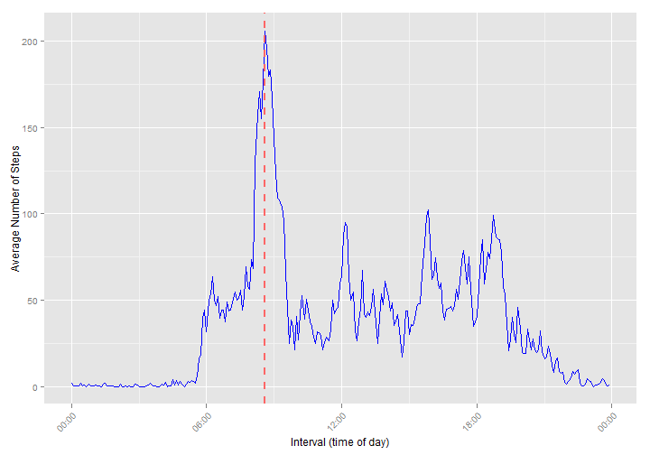
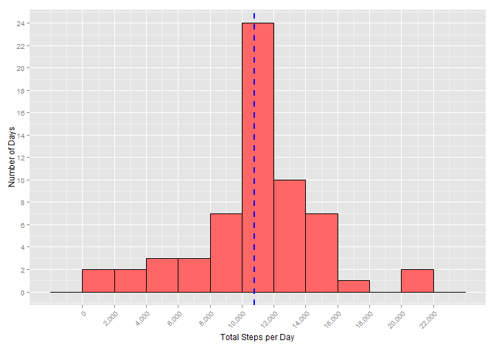
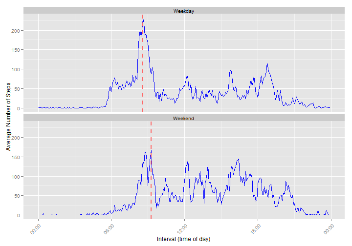

# Reproducible Research: Peer Assessment 1
This assignment makes use of data from a personal activity monitoring device. This device 
collects data at 5 minute intervals through out the day. The data consists of two months of 
data from an anonymous individual collected during the months of October and November, 2012 
and include the number of steps taken in 5 minute intervals each day.

The variables included in this dataset are:

- **steps**: Number of steps taking in a 5-minute interval (missing values are coded as NA)
- **date**: The date on which the measurement was taken in YYYY-MM-DD format
- **interval**: Identifier for the 5-minute interval in which measurement was taken

The dataset is stored in a comma-separated-value (CSV) file and there are a total of 17,568 
observations in this dataset. The purpose of this assignment is to load and analyze the data 
to answer the following questions:

1. What is mean/median total number of steps taken per day (ignoring missing values)?
2. What is the average daily activity pattern?
3. What is mean/median total number of steps taken per day (imputing missing values)?
4. Are there differences in activity patterns between weekdays and weekends?

## Loading and preprocessing the data
Load the necessary packages.

```r
require(data.table)
require(ggplot2)
require(scales)
require(lubridate)
```
Unzip the file if not already unzipped, downloading the source zip file as necessary.

```r
unzipped_file <- "./activity.csv" 
if (!file.exists(unzipped_file)) {
    local_zipfile <- "./activity.zip"
    if (!file.exists(local_zipfile)) {
        url <- "http://d396qusza40orc.cloudfront.net/repdata%2Fdata%2Factivity.zip"
        download.file(url, destfile = local_zipfile, mode = "wb")
    }
    unzip(local_zipfile)
}
```
Load and preprocess the data, creating an original data table and a subset containing
only complete cases.

```r
orig_dt <- data.table(read.csv(unzipped_file, stringsAsFactors = F))
orig_dt$date <- as.POSIXct(orig_dt$date, tz = "UTC")
orig_dt$interval <- parse_date_time(sprintf("%04d",orig_dt$interval), "HM")
sub_dt <- orig_dt[complete.cases(orig_dt),]
```
## What is the mean/median total number of steps taken per day (ignoring missing values)?
Create a tidy dataset from the subset containing only complete cases.

```r
tidy1_dt <- sub_dt[, lapply(.SD, sum), by = date, .SDcols = "steps"]
```
Generate a histogram of the number of days by range (in 2,000 step increments) 
of total steps per day with a dashed line indicating the mean.

```r
print(ggplot(tidy1_dt, aes(x = steps))
    + geom_histogram(binwidth = 2000, color = "black", fill = "#FF6666")
    + scale_x_continuous(breaks = seq(0, 22000, 2000), labels = comma)
    + scale_y_continuous(breaks = seq(0, 16, 2))
    + labs(x = "Total Steps per Day", y = "Number of Days")
    + theme(axis.text.x = element_text(angle = 45, hjust = 1))
    + geom_vline(aes(xintercept=mean(steps)),
        color = "blue", linetype = "dashed", size = 1))
```

 

Calculate the mean and median of the tidy dataset.

```r
cat(paste("Mean: ", signif(mean(tidy1_dt$steps)), ", Median: ",
    median(tidy1_dt$steps), "\n", sep = ""))
```

```
## Mean: 10766.2, Median: 10765
```
## What is the average daily activity pattern?
Create a tidy dataset from the subset containing only complete cases and 
validate that the tidy dataset sum matches the mean from the previous question.

```r
tidy2_dt <- sub_dt[, lapply(.SD, mean), by = interval, .SDcols = "steps"]
cat(paste("Same mean: ", sum(tidy2_dt$steps) == mean(tidy1_dt$steps), "\n", sep = ""))
```

```
## Same mean: TRUE
```
Generate a plot of the average number of steps by time-of-day interval 
with a dashed line indicating the interval with the maximum number of steps.

```r
print(ggplot(tidy2_dt, aes(interval, steps))
    + geom_line(color = "blue")
    + labs(x = "Interval (time of day)", y = "Average Number of Steps")
    + scale_x_datetime(labels=date_format("%H:%M"))
    + theme(axis.text.x = element_text(angle = 45, hjust = 1))
    + geom_vline(data = tidy2_dt,
        aes(xintercept=as.numeric(tidy2_dt[steps == max(steps)]$interval)),
        color = "#FF6666", linetype = "dashed", size = 1))
```

 

Determine the specific time-of-day interval with the maximum average steps.

```r
cat(paste("Interval: ", format(tidy2_dt[steps == max(steps)]$interval, "%R"), 
    " - ", format(tidy2_dt[steps == max(steps)]$interval + 300, "%R"), " (", 
    round(tidy2_dt[steps == max(steps)]$steps, 0), " steps)\n", sep = ""))
```

```
## Interval: 08:35 - 08:40 (206 steps)
```
## Imputing missing values
Calculate the total number of missing values in the original dataset.

```r
cat(paste("Missing values: ", sum(is.na(orig_dt$steps)), "\n", sep = ""))
```

```
## Missing values: 2304
```
Mean imputation was selected as the strategy for this assignment because it is one 
of the most frequently used methods. It also preserves the mean of the original 
dataset.

Create a full dataset from the original, filling in all of the missing step values 
by interval with the rounded mean of the steps per interval as previously calculated 
and confirming that no missing values remain.

```r
full_dt <- orig_dt

for (i in 1:dim(full_dt)[1]) {
    if (is.na(full_dt[i]$steps)) {
        full_dt[i]$steps <- round(tidy2_dt[interval == full_dt[i]$interval]$steps)
    }
}
cat(paste("No missing values: ", sum(is.na(full_dt$steps)) == 0), "\n", sep = "")
```

```
## No missing values:  TRUE
```
Create a tidy dataset from the full dataset with imputed values. 

```r
tidy3_dt <- full_dt[, lapply(.SD, sum), by = date, .SDcols = "steps"]
```
Generate a histogram of the number of days by range (in 2,000 step increments) 
of total steps per day with a dashed line indicating the mean.

```r
print(ggplot(tidy3_dt, aes(x = steps))
    + geom_histogram(binwidth = 2000, color = "black", fill = "#FF6666")
    + scale_x_continuous(breaks = seq(0, 22000, 2000), labels = comma)
    + scale_y_continuous(breaks = seq(0, 24, 2))
    + labs(x = "Total Steps per Day", y = "Number of Days")
    + theme(axis.text.x = element_text(angle = 45, hjust = 1))
    + geom_vline(aes(xintercept=mean(steps)),
        color = "blue", linetype = "dashed", size = 1))
```

 

Calculate the mean and median of the tidy dataset.

```r
cat(paste("Mean: ", signif(mean(tidy3_dt$steps)), ", Median: ",
    median(tidy3_dt$steps), "\n", sep = ""))
```

```
## Mean: 10765.6, Median: 10762
```
The rounded mean remains unchanged because of the strategy employed to impute 
missing values.

```r
cat("Rounded mean unchanged: ", paste(round(mean(full_dt[, lapply(.SD, sum), 
    by = date, .SDcols = "steps"]$steps)) == round(mean(tidy1_dt$steps))), "\n", sep = "")
```

```
## Rounded mean unchanged: TRUE
```

The median has changed slightly, because the 8 days with imputed values all 
have a total of 10762 steps (which occur in the middle of the 61 days).

```r
cat(paste("Number of days with missing values: ", 
    length(unique(orig_dt[!complete.cases(orig_dt)]$date)),
    "\nTotal imputed steps per missing day: ", sum(round(tidy2_dt$steps)),
    "\nOriginal median: ", median(tidy1_dt$steps), " (", dim(tidy1_dt)[1], 
    " days) Revised median: ", median(tidy3_dt$steps), " (", 
    dim(tidy3_dt)[1], " days)\n", sep = ""))
```

```
## Number of days with missing values: 8
## Total imputed steps per missing day: 10762
## Original median: 10765 (53 days) Revised median: 10762 (61 days)
```
The impact of imputing missing data on the estimates of the total daily number 
of steps varies with the methodology employed. Some of the problems with the choice 
for this assignment of mean imputation are: 

- The sample size is overestimated, 
- The variance is underestimated, 
- The correlation is negatively biased, and 
- The distribution of new values incorrectly represent the population values 
because the distribution shape is distorted by adding values equal to the mean.

Replacing missing data with a single value deflates the variance and 
artificially inflates the significance of any statistical tests based on it. [1]

[1] http://academic.uprm.edu/~eacuna/IFCS04r.pdf

## Are there differences in activity patterns between weekdays and weekends?
Add a weekday factor to the full dataset with imputed values and create a tidy
dataset of means by weekday factor and interval. Also, create an additional dataset 
for plotting, containing the interval with the maximum number of steps per weekday factor.

```r
full_dt$weekday <- as.factor(ifelse(weekdays(full_dt$date) == "Saturday" | 
    weekdays(full_dt$date) == "Sunday", "Weekend", "Weekday"))
tidy4_dt <- full_dt[, lapply(.SD, mean), by = list(weekday, interval), .SDcols = "steps"]
vline_dt <- data.table(weekday = levels(tidy4_dt$weekday), 
    xint = tidy4_dt[,.SD[which.max(steps)],by=weekday]$interval)
```
Generate a plot by weekday factor of the average number of steps by time-of-day interval 
with a dashed line indicating the interval with the maximum number of steps.

```r
print(ggplot(tidy4_dt, aes(interval, steps))
    + geom_line(color = "blue")
    + facet_wrap(~ weekday, ncol = 1)
    + labs(x = "Interval (time of day)", y = "Average Number of Steps")
    + scale_x_datetime(labels=date_format("%H:%M"))
    + theme(axis.text.x = element_text(angle = 45, hjust = 1))
    + geom_vline(data = vline_dt,
        aes(xintercept = as.numeric(xint)),
        color = "#FF6666", linetype = "dashed", size = 1))
```

 

There are observable differences in activity patterns between weekdays and weekends, 
including different:

- Mean/median total number of steps taken per interval and
- Time-of-day interval with different maximum average steps.

Further analysis should be done, however, to determine if these differences 
are statistically significant.

```r
cat(paste("Weekday mean by interval: ", signif(mean(tidy4_dt[weekday == "Weekday"]$steps)), 
    ", Median: ", signif(median(tidy4_dt[weekday == "Weekday"]$steps)),
    "\nWeekend mean by interval: ", signif(mean(tidy4_dt[weekday == "Weekend"]$steps)),
    ", Median: ", signif(median(tidy4_dt[weekday == "Weekend"]$steps)),
    "\nWeekday interval with max steps: ", format(vline_dt$xint[1], "%R"), " - ", 
    format(vline_dt$xint[1] + 300, "%R"), " (", 
    round(tidy4_dt[interval == vline_dt$xint[1]]$steps[1]), " max steps)",
    "\nWeekend interval with max steps: ", format(vline_dt$xint[2], "%R"), " - ", 
    format(vline_dt$xint[2] + 300, "%R"), " (", 
    round(tidy4_dt[interval == vline_dt$xint[2]]$steps[2]), " max steps)\n", sep = ""))
```

```
## Weekday mean by interval: 35.6086, Median: 25.8111
## Weekend mean by interval: 42.3646, Median: 32.3125
## Weekday interval with max steps: 08:35 - 08:40 (230 max steps)
## Weekend interval with max steps: 09:15 - 09:20 (167 max steps)
```
